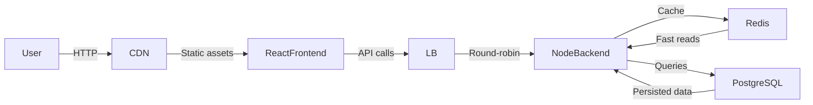

# Architecture

## Layers

- **User → CDN**: Browser requests are served via a CDN edge.
- **CDN → React Frontend**: Static SPA assets (HTML, JS, CSS) cached at the edge.
- **React Frontend → Load Balancer**: API calls routed through an L7 load balancer.
- **Load Balancer → Node.js Backend**: Round-robin distribution across backend instances.
- **Node.js Backend ↔ Redis**: Hot data and session cache for low-latency reads.
- **Node.js Backend ↔ PostgreSQL**: System of record for persisted data.
